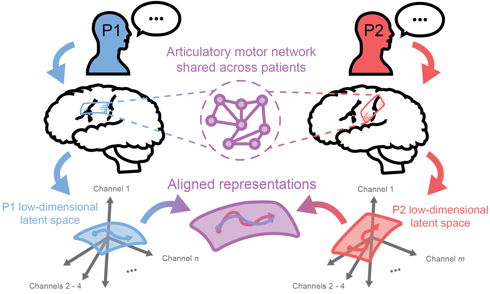

# Cross Patient Speech Decoding

## Overview

This repository contains code used in analyses and creation of figures for the paper "Cross patient speech decoding from shared latent representations of speech production". 

We use an approach based on canonical correlation analysis (CCA) to learn an alignment between latent neural representations of speech production recorded with micro-electrocorticography (μECoG) arrays from multiple patients. We show that patient-specific neural data can be aligned to a shared cross-patient latent space, enabling the training of cross-patient speech decoding models that outperform patient-specific models.

For more details, please check out our preprint! [Spalding et al. 2025, bioRxiv](https://TODO_MAKE_ARXIV_LINK.wow)

## Requirements

All analyses were performed in Python $\geq$ 3.10. Packages used can be found in the `environment.yml` and `requirements.txt` files. 

## Usage

Analyses and code for all main figures in the paper (excluding figure 1, which is primarily illustrative) can be found in `aligned_decoding/figures_analyses/fig_X.ipynb` as notebooks stepping through anaylses performed in each figure. Analyses and code for relevant supplementary figures is also included in `aligned_decoding/figure_analyses/supp/supp_fig_X.ipynb`.

Aditional directories within `aligned_decoding/` contain `.py` files with functionality relevant to various analyses:
- `aligned_decoding/alignment/`: Classes and utility funcitons for various alignment methods, including CCA, multiview CCA (MCCA), and joing PCA.
- `aligned_decoding/decoders/`: Wrapper classes to enable easy cross-patient decoding with *scikit-learn*-style decoders.
- `aligned_decoding/decomposition/`: Dimensionality reduction methods, including a wrapper to perform dimensionality reduction while properly reshaping data with more than two dimensions.
- `aligned_decoding/nn_models/`: Classes and utility functions defining *PyTorch Lightning* modules for training sequence-to-sequence recurrent neural networks with both patient-specific and cross-patient inputs.
- `aligned_decoding/processing_utils/`: Utility functions for processing neural data, including data saving and subsampling.
- `aligned_decoding/scripts/`: Scripts for running various decoding analyses (e.g. SVM-based, RNN-based, subsampled w.r.t. spatial characteristics, etc.) structured to be called by upstream compute-cluster job scripts.